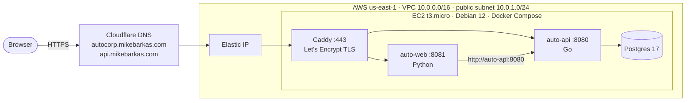

# cloudlab

This repo contains the configuration and apps I use for learning and experimenting with cloud platforms.

Most projects are built with Terraform and provisioned with Ansible.

Hybrid cloud infrastructure combines my cloudlab and homelab.

## Cloud Providers

AWS is my primary platform. The Jenkins project runs on Linode. `autocorp/web/terraform` is an earlier version of the AutoCorp front end on Azure Container Instances; it is kept for reference and not deployed.

## Projects

| Project | Description | Tools | Status |
|---|---|---|---|
| [AutoCorp](autocorp/) | Go API, Python web app, and Postgres running in Docker Compose on one EC2 instance, behind Caddy with automatic TLS. DNS records in Cloudflare. Moved here from `auto-corp-infra` with its full history. | Terraform, Ansible, Docker Compose, Caddy, Cloudflare, GitHub Actions | Active |
| [Jenkins](infra/jenkins/) | Jenkins controller behind an Nginx reverse proxy on a Linux server | Terraform, Ansible, Linode | Complete |

## AutoCorp on AWS

> **Status:** https://autocorp.mikebarkas.com

### Architecture



- The security group allows 80 and 443 from anywhere and 22 from one admin CIDR. Only Caddy publishes ports; the API, web app, and Postgres are reachable only on the compose network.
- Around the app: Terraform state in an encrypted S3 bucket, a read-only GitHub Actions role (OIDC) that posts `terraform plan` on pull requests, and a $25/month AWS Budget.

### What each directory provisions

| Directory | Provisions | Terraform state |
|---|---|---|
| `account/bootstrap` | S3 bucket for Terraform state: versioned, encrypted, public access blocked | Local (the bucket can't hold its own state) |
| `account/budget` | $25/month AWS Budget with email alerts | S3 |
| `account/github-oidc` | GitHub OIDC provider and the read-only plan role for pull requests | S3 |
| `autocorp/api/terraform` | VPC, subnet, internet gateway, route table, security group, network interface, EC2 instance, Elastic IP | S3 |
| `autocorp/cloudflare` | DNS A records for the API and web subdomains, pointing at the Elastic IP | Local |
| `autocorp/api/ansible` | Docker and the compose plugin, then the compose stack: Caddy, API, web app, Postgres | n/a |
| `autocorp/web/terraform` | Earlier Azure version of the web app (not deployed) | Local |

### Deploy

Apply in this order. Values that aren't committed (admin CIDR, SSH key name, alert email, Cloudflare token and zone, database password) come from `.tfvars` files, `TF_VAR_` environment variables, or `secrets.yml`, all gitignored.

```bash
# 1. Account setup, once
cd account/bootstrap   && terraform init && terraform apply
cd ../budget           && terraform init && terraform apply
cd ../github-oidc      && terraform init && terraform apply

# 2. Network and server
cd ../../autocorp/api/terraform && terraform init && terraform apply

# 3. DNS records pointing at the new Elastic IP
cd ../../cloudflare && terraform init && terraform apply

# 4. Containers
cd ../api/ansible
ansible-galaxy collection install -r requirements.yml
ansible-playbook api.yml -e @secrets.yml

# 5. Check
curl https://api.mikebarkas.com/json
```

### Tear down

```bash
cd autocorp/cloudflare     && terraform destroy
cd ../api/terraform        && terraform destroy
```

The account stacks stay: the state bucket holds every stack's state, and the budget is free.

### Cost

Estimated on-demand prices in us-east-1, running 24/7:

| Item | Monthly |
|---|---|
| EC2 t3.micro | ~$7.60 |
| Public IPv4 address (Elastic IP) | ~$3.65 |
| EBS root volume (~8 GiB gp3) | ~$0.65 |
| S3 Terraform state | < $0.05 |
| AWS Budget (first two per account are free) | $0 |
| Cloudflare DNS, Let's Encrypt, GitHub Actions (public repo) | $0 |
| **Total while running** | **~$12** |
| **Total when torn down** | **< $0.05** (state bucket only) |

## Terraform Remote State

Terraform state for each AWS stack is stored in an encrypted, versioned S3 bucket, one key per stack. The bucket is private and has S3 public access blocked. Terraform 1.11 or newer uses native S3 locking with `use_lockfile = true`.

### Bootstrap

Create the state bucket (`account/bootstrap/`) before initializing any other stack. The bootstrap configuration uses local state because the S3 backend cannot store its own state until the bucket exists.

The bucket must be in `us-east-1` and have:

- S3 versioning enabled
- Server-side encryption enabled
- All S3 public access blocked

After the bucket exists, migrate the API stack's existing local state:

```bash
cd autocorp/api/terraform
terraform init -migrate-state
terraform plan
```

The API state is stored at `autocorp/api/terraform.tfstate` in the S3 bucket. The Cloudflare stack reads the API output from that object through `terraform_remote_state`:

```hcl
data "terraform_remote_state" "api" {
  backend = "s3"

  config = {
    bucket = "cloudlab-terraform-state-mikebarkas"
    key    = "autocorp/api/terraform.tfstate"
    region = "us-east-1"
  }
}
```

Never commit Terraform state, `.tfvars` files, credentials, or private keys. The S3 bucket name and backend key must match the values in the API and Cloudflare Terraform configurations.

## Design Decisions

Why things are built the way they are, and what each choice trades off.

### Terraform

- **One state file per stack** (`account/budget`, `account/github-oidc`, `autocorp/api`). Each stack plans and applies on its own, so a mistake in one can't touch the others.
- **S3 native locking (`use_lockfile = true`) instead of DynamoDB.** One less resource to create and pay for. Requires Terraform 1.11 or newer.
- **Bootstrap uses local state.** The state bucket can't store its own state before it exists.
- **Version pins: `required_version = ">= 1.11"` and AWS provider `~> 6.0`.** The Terraform lower bound is the minimum (native S3 locking), not the version I happen to run. The provider accepts any 6.x but never 7.0, so breaking major upgrades are a deliberate change. Lock files are committed so everyone, including CI, uses the exact same provider build.
- **AMI from a data source, filtered by Debian's AWS account ID.** Anyone can publish an image named `debian-12-*`; filtering on the owner guarantees the official image.
- **`ignore_changes = [ami]` on the instance.** With `most_recent = true`, every new Debian release would otherwise replace the server on the next apply. New instances get the latest image; existing ones are replaced on purpose with `terraform apply -replace`.
- **`default_tags` on the provider** instead of `tags` on every resource. Every stack tags its resources with `Project`, `Stack`, and `ManagedBy`, and new resources are tagged automatically. That keeps Cost Explorer grouping by stack and resource searches complete.
- **t3.micro instead of t2.micro.** Newer generation and free tier eligible.

### Networking and security

- **Caddy reverse proxy on 443 in front of the API.** Caddy gets and renews Let's Encrypt certificates on its own. The API listens on 8080, which the security group does not expose.
- **SSH limited to one admin CIDR** instead of `0.0.0.0/0`. Trade-off: the rule needs updating when my IP changes.
- **One Elastic IP association**, via `aws_eip_association` on the network interface. Associating the same address in two places can cause drift between plans.
- **The web app calls the API over the compose network** (`API_URL=http://auto-api:8080/search`), not the public `api.mikebarkas.com`. It's faster, skips a TLS round trip, and keeps working if DNS or the certificate has a problem.

### Deployment

- **Images are pulled from Docker Hub, not built on the server.** The API (`mikebarkas/auto-corp-api`) and web app (`mikebarkas/auto-corp-web`) use pinned tags, so every deploy runs the same version until the tag is changed on purpose.
- **Caddy runs as a container, not an apt package.** Caddy's third-party apt signing key expired and blocked deploys ([#36](https://github.com/mikebarkas/cloudlab/issues/36)). The official image removes that dependency, and pinning the major version (`caddy:2`) keeps upgrades deliberate.
- **Postgres is pinned to major version 17.** Postgres 18 changes the data directory layout, so a major upgrade has to be planned, not picked up by accident.
- **The database password is never committed.** Ansible takes it from `secrets.yml` (gitignored) or `-e`, and writes it to a `.env` file on the server for Compose.

### CI/CD

- **GitHub Actions authenticates to AWS with OIDC.** No AWS access keys are stored anywhere; each run gets temporary credentials that expire in about an hour.
- **The plan role is read-only and trusted only for pull requests from this repo.** Its one write permission is the Terraform lock file in the state bucket, which `plan` needs. Apply will use a separate role behind a manual approval ([#30](https://github.com/mikebarkas/cloudlab/issues/30)), so a pull request can never change infrastructure.
- **Plans are posted as PR comments, with sensitive values hidden.** The repo is public and GitHub masks secrets in logs, not in comments. The admin CIDR and alert email are `sensitive` variables, and the workflow replaces the AWS account ID with `***` before posting.
- **tflint fails on warnings**, so unpinned providers or unused variables can't be merged.

### Cost

- **$25/month AWS Budget**, alerting at 50% and 80% of actual spend and 100% of forecasted spend. The forecast alert warns before the limit is reached, not after.

## What I would do next in production

This is a single-instance lab sized for a $25/month budget. For production traffic I would change:

- **High availability:** an Application Load Balancer and an Auto Scaling group across two availability zones, instead of one instance with an Elastic IP.
- **Private subnets:** app instances in private subnets behind the load balancer, with a NAT gateway for outbound traffic.
- **Managed database:** Amazon RDS for Postgres with automated backups and Multi-AZ, instead of Postgres in a container on the app server.
- **Secrets:** AWS Secrets Manager or SSM Parameter Store instead of a `.env` file.
- **Access:** SSM Session Manager instead of SSH, so port 22 closes entirely.
- **Observability:** container logs in CloudWatch Logs ([#21](https://github.com/mikebarkas/cloudlab/issues/21)) and alarms on instance health ([#22](https://github.com/mikebarkas/cloudlab/issues/22)).
- **Deploys:** apply through a GitHub Actions job behind a manual approval ([#30](https://github.com/mikebarkas/cloudlab/issues/30)), and images built and scanned in CI.

## Related repositories

- [auto-corp-api](https://github.com/mikebarkas/auto-corp-api): Go API application
- [auto-corp-web](https://github.com/mikebarkas/auto-corp-web): Python web front end
- [homelab](https://github.com/mikebarkas/homelab): Kubernetes (k3s) homelab running the same apps on premises
